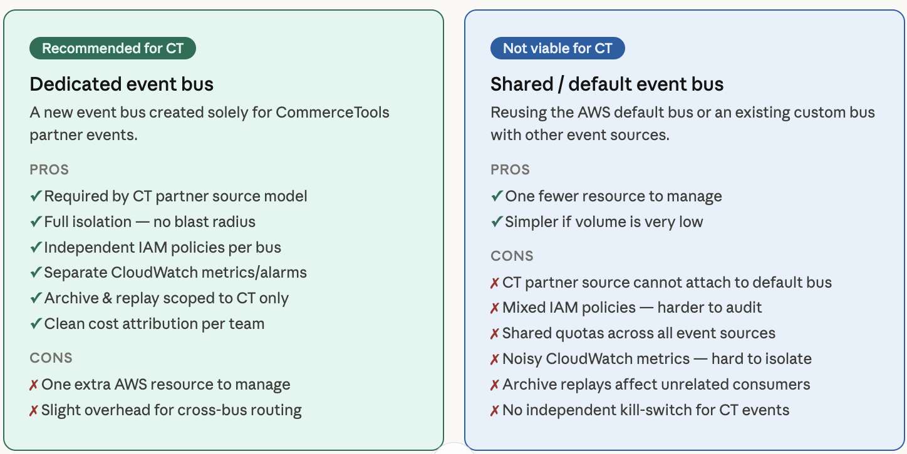

# commercetools → AWS EventBridge Subscriptions

Routes commercetools order events to an AWS SQS queue via EventBridge, then consumes them with a Node.js client.

## Architecture



> This project uses a **dedicated event bus** (recommended): a new bus created solely for the commercetools partner event source, giving full isolation, independent IAM policies, and scoped CloudWatch metrics. Reusing the AWS default or an existing shared bus is not viable — the CT partner source cannot attach to the default bus, and sharing introduces mixed IAM policies, noisy metrics, and no independent kill-switch.

```
commercetools Platform
        │  order events (OrderCreated, OrderStateChanged, etc.)
        ▼
commercetools Subscription (EventBridge destination)
        │  partner event source
        ▼
AWS EventBridge (Custom Event Bus)
        │  rule: detail.resource.typeId = "order"
        ▼
SQS Queue: ct-order-events
        │  long-poll
        ▼
Node.js Consumer (client/)
        │  on failure (×3)
        ▼
SQS Dead-Letter Queue (DLQ)
```

## Repository Structure

```
├── terraform/      # Infrastructure as code — provisions all AWS + commercetools resources
└── client/         # Node.js SQS consumer — polls the queue and processes order events
```

---

## terraform/

Terraform configuration that provisions the full event pipeline end-to-end:

| Resource | Purpose |
|---|---|
| `aws_cloudwatch_log_resource_policy` | Grants `delivery.logs.amazonaws.com` write access — required for CT to validate the EventBridge destination on subscription creation |
| `commercetools_subscription` | Creates the CT subscription with an EventBridge destination |
| `aws_cloudwatch_event_bus` | Custom event bus associated with the CT partner event source |
| `aws_cloudwatch_event_rule` | Filters events where `detail.resource.typeId = "order"` |
| `aws_sqs_queue` (ct-order-events) | Main queue holding matched order events |
| `aws_sqs_queue` (DLQ) | Dead-letter queue for messages that fail 3 delivery attempts |

### Prerequisites

- Terraform >= 1.3.0
- AWS credentials with permissions to manage EventBridge, SQS, CloudWatch Logs, and IAM policies
- commercetools API client with scope `manage_subscriptions:<project-key>`

### IAM Policies

Three separate permission grants are required for the pipeline to work end-to-end. Missing any one of them causes silent failures.

#### 1. CloudWatch Logs resource policy (subscription validation)

commercetools validates the EventBridge destination during subscription creation by checking that `delivery.logs.amazonaws.com` can write to the vended log group for that event bus:

```
/aws/vendedlogs/events/event-bus/aws.partner/commercetools.com/<project>/<subscription-key>
```

This is provisioned by `aws_cloudwatch_log_resource_policy` in Terraform. Without it, subscription creation fails with:

> _Permissions are set correctly to allow AWS CloudWatch Logs to write into your logs while creating a subscription._

The `commercetools_subscription` resource has `depends_on` this policy so Terraform creates it first.

#### 2. SQS queue policy (EventBridge → SQS delivery)

The main queue has a resource-based policy allowing `events.amazonaws.com` to call `sqs:SendMessage`, scoped to the specific rule ARN:

```json
{
  "Effect": "Allow",
  "Principal": { "Service": "events.amazonaws.com" },
  "Action": "sqs:SendMessage",
  "Resource": "<queue-arn>",
  "Condition": {
    "ArnEquals": { "aws:SourceArn": "<rule-arn>" }
  }
}
```

This is provisioned by `aws_sqs_queue_policy` in Terraform.

#### 3. SQS encryption — use SSE-SQS, not SSE-KMS with the AWS managed key

Both queues use `sqs_managed_sse_enabled = true` (SSE-SQS). **Do not use `kms_master_key_id = "alias/aws/sqs"`** (SSE-KMS with the AWS managed key).

| Encryption mode | How it works | EventBridge compatible |
|---|---|---|
| `sqs_managed_sse_enabled = true` | SQS encrypts internally — no KMS API call from the caller | **Yes** |
| `kms_master_key_id = "alias/aws/sqs"` | Calls KMS API — EventBridge needs `kms:GenerateDataKey` on that key, which the AWS managed key policy does not grant to other services | **No** — delivery silently fails |

If SSE-KMS is required (e.g. for key rotation or cross-account access), use a **customer-managed KMS key** and add an explicit statement granting `events.amazonaws.com` the `kms:GenerateDataKey` and `kms:Decrypt` actions.

### EventBridge Rule Pattern

The event rule matches on the actual commercetools event structure — **not** the flat `resource_type_id` field:

```json
{
  "detail": {
    "resource": {
      "typeId": ["order"]
    }
  }
}
```

Using `detail.resource_type_id` (snake_case, flat) will result in `NO_STANDARD_RULES_MATCHED` in EventBridge logs — the field does not exist in the event payload.

### Setup

```bash
cd terraform

# 1. Copy and fill in your credentials
cp terraform.tfvars.example terraform.tfvars
# Edit terraform.tfvars — never commit this file

# 2. Initialize providers
terraform init

# 3. Preview changes
terraform plan

# 4. Apply
terraform apply
```

---

## client/

Node.js application that long-polls the `ct-order-events` SQS queue and processes each message.

| File | Purpose |
|---|---|
| `src/index.js` | Entry point — validates env vars, starts the poll loop |
| `src/consumer.js` | Receives, processes, and deletes SQS messages; handles retries and DLQ fallback |

### Prerequisites

- Node.js >= 18
- AWS credentials with `sqs:ReceiveMessage` and `sqs:DeleteMessage` permissions on the queue

### Setup

```bash
cd client

# 1. Install dependencies
npm install

# 2. Configure environment
cp .env.example .env
# Edit .env — never commit this file
```

**Required environment variables** (in `client/.env`):

| Variable | Description |
|---|---|
| `AWS_REGION` | AWS region where the SQS queue lives (e.g. `us-east-2`) |
| `SQS_QUEUE_URL` | Full URL of the `ct-order-events` queue (from Terraform output) |
| `AWS_ACCESS_KEY_ID` | AWS access key |
| `AWS_SECRET_ACCESS_KEY` | AWS secret key |
| `AWS_SESSION_TOKEN` | Session token (required when using temporary credentials) |

### Running

```bash
# Production
npm start

# Development (auto-restarts on file changes)
npm run dev
```

The consumer logs each received message and deletes it after successful processing. Failed messages (unhandled exceptions) are left in the queue and become visible again after the visibility timeout (60 s), up to 3 attempts before moving to the DLQ.

To add business logic, edit the `processMessage` function in `src/consumer.js`.

---

## Security

- `terraform/terraform.tfvars` and `client/.env` are git-ignored — never commit credentials
- SQS queues use SSE-SQS (`sqs_managed_sse_enabled = true`) — managed by SQS, compatible with all AWS service principals
- The SQS queue policy restricts `sqs:SendMessage` to EventBridge only, scoped by rule ARN
- For production, use IAM roles instead of long-lived access keys for the Node.js consumer

## Troubleshooting

| Symptom | Cause | Fix |
|---|---|---|
| Subscription creation fails with CloudWatch Logs permissions error | `aws_cloudwatch_log_resource_policy` not created before the subscription | Ensure `depends_on = [aws_cloudwatch_log_resource_policy.eventbridge_delivery]` is set on the subscription resource |
| EventBridge logs show `NO_STANDARD_RULES_MATCHED` | Rule pattern uses `detail.resource_type_id` instead of `detail.resource.typeId` | Update the event pattern to use the nested `resource.typeId` field |
| Rule logs show `RULE_MATCH_START` but no messages appear in SQS or DLQ | Queue encrypted with SSE-KMS (`alias/aws/sqs`) — EventBridge cannot call `kms:GenerateDataKey` on the AWS managed key | Switch to `sqs_managed_sse_enabled = true`, or use a CMK with an explicit grant to `events.amazonaws.com` |

## References

- [commercetools Subscriptions + EventBridge tutorial](https://docs.commercetools.com/tutorials/subscriptions-eventbridge)
- [commercetools Terraform provider](https://registry.terraform.io/providers/labd/commercetools/latest/docs)
- [AWS EventBridge partner event sources](https://docs.aws.amazon.com/eventbridge/latest/userguide/eb-saas.html)
