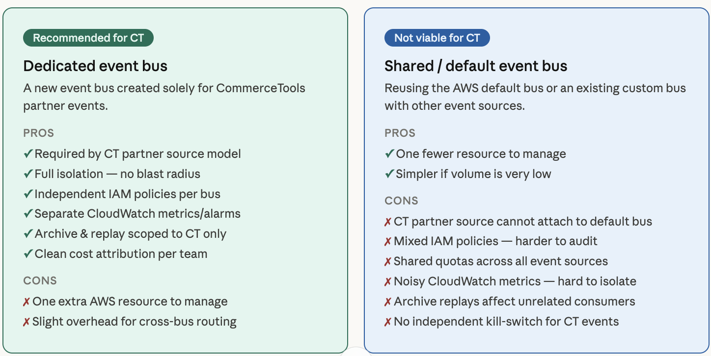

# commercetools → AWS EventBridge Subscriptions

Routes commercetools order events to an AWS SQS queue via EventBridge, then consumes them with a Node.js client.

## How It Works

The setup is split into two deliberate stages:

```
┌─────────────────────────────────────────────────────────────────┐
│  STAGE 1 — commercetools API                                    │
│                                                                 │
│  Call the CT Subscriptions API to create an EventBridge         │
│  subscription. CT registers a partner event source in AWS:      │
│                                                                 │
│    aws.partner/commercetools.com/<project>/<subscription-key>   │
│                                                                 │
│  No AWS credentials needed. No CT secrets in Terraform.         │
└─────────────────────┬───────────────────────────────────────────┘
                      │ partner event source appears in AWS
                      ▼
┌─────────────────────────────────────────────────────────────────┐
│  STAGE 2 — Terraform (AWS only)                                 │
│                                                                 │
│  Reads the partner event source by name and provisions:         │
│  • CloudWatch Logs resource policy                              │
│  • Custom EventBridge event bus                                 │
│  • EventBridge rule (filter: order events)                      │
│  • SQS queue + Dead-letter queue                                │
└─────────────────────────────────────────────────────────────────┘
```

> **Why split?** CT API credentials (client ID, secret) never touch Terraform state or `.tfvars` files. Terraform only needs AWS credentials.

## Architecture



```
commercetools Platform
        │  OrderCreated, OrderStateChanged
        ▼
CT Subscriptions API  ←── Stage 1: you call this once
        │  creates partner event source in AWS
        ▼
AWS EventBridge (Custom Event Bus)  ←── Stage 2: Terraform manages this
        │  rule: detail.resource.typeId = "order"
        ▼
SQS Queue: ct-order-events
        │  long-poll
        ▼
Node.js Consumer (client/)
        │  on failure (×3)
        ▼
SQS Dead-Letter Queue (DLQ)
```

## Repository Structure

```
├── scripts/        # CT API helpers — create/delete subscriptions without Terraform
├── terraform/      # AWS infrastructure only — no CT secrets
└── client/         # Node.js SQS consumer
```

---

## Setup

### Prerequisites

| Tool | Purpose |
|---|---|
| `curl` + `jq` | Stage 1 — call the CT API |
| Terraform >= 1.3.0 | Stage 2 — provision AWS resources |
| AWS credentials | Permissions for EventBridge, SQS, CloudWatch Logs, IAM |
| CT API client | Scope: `manage_subscriptions:<project-key>` |

---

### Stage 1 — CT API creates the EventBridge partner event source

> **This runs once per environment.** CT registers a partner event source in your AWS account that Terraform reads in Stage 2.

```bash
export CT_CLIENT_ID=<your-client-id>
export CT_CLIENT_SECRET=<your-client-secret>
export CT_PROJECT_KEY=ps-ecomm-dev1
export CT_AUTH_URL=https://auth.us-east-2.aws.commercetools.com
export CT_API_URL=https://api.us-east-2.aws.commercetools.com
export AWS_ACCOUNT_ID=<your-aws-account-id>
export AWS_REGION=us-east-2
export SUBSCRIPTION_KEY=orders-dev1

bash scripts/create-ct-subscription.sh
```

The script:
1. Fetches a short-lived CT token — credentials are never written to disk
2. Checks if the subscription already exists (idempotent — safe to re-run)
3. Creates the subscription, which causes CT to register the partner event source in AWS:
   ```
   aws.partner/commercetools.com/ps-ecomm-dev1/orders-dev1
   ```

**Verify the partner event source was created:**
```bash
# Get token
TOKEN=$(curl -sf -X POST "$CT_AUTH_URL/oauth/token" \
  -u "$CT_CLIENT_ID:$CT_CLIENT_SECRET" \
  -d "grant_type=client_credentials&scope=manage_subscriptions:$CT_PROJECT_KEY" \
  | jq -r '.access_token')

# List subscriptions
curl -s "$CT_API_URL/$CT_PROJECT_KEY/subscriptions" \
  -H "Authorization: Bearer $TOKEN" \
  | jq '.results[] | {key, status, source: .destination.source}'
```

Expected output:
```json
{
  "key": "orders-dev1",
  "status": "Healthy",
  "source": "aws.partner/commercetools.com/ps-ecomm-dev1/orders-dev1"
}
```

---

### Stage 2 — Terraform provisions the AWS event bus, rule, and SQS queue

> **Run this after Stage 1.** Terraform looks up the partner event source by name and builds all AWS resources around it.

**1. Configure variables** (no CT secrets required):

```bash
cd terraform
cp terraform.tfvars.example terraform.tfvars
```

Edit `terraform.tfvars`:

```hcl
aws_region       = "us-east-2"
aws_account_id   = "<your-aws-account-id>"
environment      = "dev"
ct_project_key   = "ps-ecomm-dev1"
subscription_key = "orders-dev1"   # must match the key used in Stage 1
```

**2. Apply:**

```bash
terraform init
terraform plan
terraform apply
```

Terraform creates:

| Resource | Name / ARN |
|---|---|
| CloudWatch Logs resource policy | `ps-ecomm-dev1-dev-eventbridge-log-delivery` |
| EventBridge event bus | `aws.partner/commercetools.com/ps-ecomm-dev1/orders-dev1` |
| EventBridge rule | `ps-ecomm-dev1-dev-ct-order-rule` |
| SQS queue | `ct-order-events` |
| SQS dead-letter queue | `ps-ecomm-dev1-dev-ct-order-events-dlq` |

**3. Note the outputs:**

```
order_events_queue_url = "https://sqs.us-east-2.amazonaws.com/..."
dlq_url                = "https://sqs.us-east-2.amazonaws.com/..."
event_bus_name         = "aws.partner/commercetools.com/ps-ecomm-dev1/orders-dev1"
```

---

### Stage 3 — Start the Node.js consumer

```bash
cd client
npm install
cp .env.example .env
# fill in AWS_REGION and SQS_QUEUE_URL from terraform output
npm start
```

**Required environment variables** (`client/.env`):

| Variable | Description |
|---|---|
| `AWS_REGION` | `us-east-2` |
| `SQS_QUEUE_URL` | From `terraform output order_events_queue_url` |
| `AWS_ACCESS_KEY_ID` | AWS access key |
| `AWS_SECRET_ACCESS_KEY` | AWS secret key |
| `AWS_SESSION_TOKEN` | Required when using temporary credentials |

---

## IAM Policies

Three permission grants are required. Missing any one causes silent failures.

### 1. CloudWatch Logs resource policy (Stage 1 prerequisite)

CT validates the EventBridge destination during subscription creation by checking that `delivery.logs.amazonaws.com` can write to the vended log group:

```
/aws/vendedlogs/events/event-bus/aws.partner/commercetools.com/<project>/<subscription-key>
```

Provisioned by `aws_cloudwatch_log_resource_policy` in Terraform. Without it, CT rejects the subscription with:

> _Permissions are set correctly to allow AWS CloudWatch Logs to write into your logs while creating a subscription._

> **Important:** Run `terraform apply` (Stage 2) **before** creating the CT subscription (Stage 1) so this policy exists when CT validates the destination.

### 2. SQS queue policy (EventBridge → SQS delivery)

Allows `events.amazonaws.com` to send messages, scoped to the specific rule ARN:

```json
{
  "Effect": "Allow",
  "Principal": { "Service": "events.amazonaws.com" },
  "Action": "sqs:SendMessage",
  "Resource": "<queue-arn>",
  "Condition": {
    "ArnEquals": { "aws:SourceArn": "<rule-arn>" }
  }
}
```

Provisioned by `aws_sqs_queue_policy` in Terraform.

### 3. SQS encryption — SSE-SQS, not SSE-KMS

Both queues use `sqs_managed_sse_enabled = true`. **Do not use `kms_master_key_id = "alias/aws/sqs"`.**

| Mode | How it works | EventBridge compatible |
|---|---|---|
| `sqs_managed_sse_enabled = true` | SQS encrypts internally — no KMS call from the caller | **Yes** |
| `kms_master_key_id = "alias/aws/sqs"` | Calls KMS API — EventBridge lacks `kms:GenerateDataKey` on the AWS managed key | **No** — delivery silently fails |

For SSE-KMS, use a customer-managed key with an explicit grant to `events.amazonaws.com` for `kms:GenerateDataKey` and `kms:Decrypt`.

---

## EventBridge Rule Pattern

The rule matches on the actual CT event structure. **Do not use the flat `resource_type_id` field** — it does not exist in the event payload.

```json
{
  "detail": {
    "resource": {
      "typeId": ["order"]
    }
  }
}
```

---

## Managing Subscriptions

**List all subscriptions:**
```bash
curl -s "$CT_API_URL/$CT_PROJECT_KEY/subscriptions" \
  -H "Authorization: Bearer $TOKEN" \
  | jq '.results[] | {key, status, source: .destination.source}'
```

**Delete a subscription:**
```bash
# Get version first
curl -s "$CT_API_URL/$CT_PROJECT_KEY/subscriptions/key=<KEY>" \
  -H "Authorization: Bearer $TOKEN" | jq '{key, version}'

# Delete
curl -s -X DELETE "$CT_API_URL/$CT_PROJECT_KEY/subscriptions/key=<KEY>?version=<VERSION>" \
  -H "Authorization: Bearer $TOKEN" | jq '{id, key}'
```

**Tear down all AWS resources:**
```bash
cd terraform && terraform destroy
```

---

## Teardown

Remove the environment in this exact order. Reversing the order will leave orphaned resources.

---

### Step 1 — Stop the Node.js consumer

```bash
# Ctrl+C in the terminal running npm start
# or if running as a background process:
pkill -f "node src/index.js"
```

---

### Step 2 — Destroy AWS infrastructure (Terraform)

Removes the event bus, rule, SQS queues, and CloudWatch Logs resource policy.

```bash
cd terraform
terraform destroy -auto-approve
```

> **Why before Step 3?** The event bus must be deleted before the CT subscription is deleted. If you delete the CT subscription first, the partner event source disappears from AWS and Terraform loses its reference — `terraform destroy` will error.

---

### Step 3 — Delete the CT subscription (removes partner event source from AWS)

Get a token, then delete the subscription by key.

```bash
# Get token
TOKEN=$(curl -sf -X POST "https://auth.us-east-2.aws.commercetools.com/oauth/token" \
  -u "$CT_CLIENT_ID:$CT_CLIENT_SECRET" \
  -d "grant_type=client_credentials&scope=manage_subscriptions:$CT_PROJECT_KEY" \
  | jq -r '.access_token')

# Get current version
VERSION=$(curl -s "https://api.us-east-2.aws.commercetools.com/$CT_PROJECT_KEY/subscriptions/key=orders-dev1" \
  -H "Authorization: Bearer $TOKEN" | jq -r '.version')

# Delete
curl -s -X DELETE "https://api.us-east-2.aws.commercetools.com/$CT_PROJECT_KEY/subscriptions/key=orders-dev1?version=$VERSION" \
  -H "Authorization: Bearer $TOKEN" | jq '{id, key}'
```

Deleting the subscription removes the partner event source `aws.partner/commercetools.com/<project>/orders-dev1` from AWS automatically.

---

### Step 4 — Verify everything is removed

```bash
# Confirm no CT subscriptions remain
TOKEN=$(curl -sf -X POST "https://auth.us-east-2.aws.commercetools.com/oauth/token" \
  -u "$CT_CLIENT_ID:$CT_CLIENT_SECRET" \
  -d "grant_type=client_credentials&scope=manage_subscriptions:$CT_PROJECT_KEY" \
  | jq -r '.access_token')

curl -s "https://api.us-east-2.aws.commercetools.com/$CT_PROJECT_KEY/subscriptions" \
  -H "Authorization: Bearer $TOKEN" | jq '{total: .total}'

# Confirm no event buses remain
aws events list-event-buses \
  --name-prefix "aws.partner/commercetools.com" \
  --region us-east-2 | jq '.EventBuses | length'

# Confirm SQS queues are gone
aws sqs list-queues \
  --queue-name-prefix "ct-order-events" \
  --region us-east-2 | jq '.QueueUrls'
```

Expected output: `{ "total": 0 }`, `0`, `null`

---

## Troubleshooting

| Symptom | Cause | Fix |
|---|---|---|
| CT subscription creation fails with CloudWatch Logs permissions error | CloudWatch Logs resource policy doesn't exist yet | Run `terraform apply` (Stage 2) before creating the CT subscription (Stage 1) |
| EventBridge logs show `NO_STANDARD_RULES_MATCHED` | Rule pattern uses `detail.resource_type_id` instead of `detail.resource.typeId` | Update the event pattern to use the nested `resource.typeId` field |
| `RULE_MATCH_START` in logs but no messages in SQS or DLQ | Queue uses SSE-KMS with `alias/aws/sqs` — EventBridge can't call `kms:GenerateDataKey` | Switch to `sqs_managed_sse_enabled = true` |
| `DuplicateField` error on subscription creation | Subscription key already exists in CT | Use a different key or delete the existing subscription first |

---

## Security

- CT credentials (`CT_CLIENT_ID`, `CT_CLIENT_SECRET`) are only used in Stage 1 as shell env vars — never written to Terraform state or `.tfvars` files
- `terraform/terraform.tfvars` and `client/.env` are git-ignored
- SQS queues use SSE-SQS — transparent encryption, no KMS overhead
- SQS queue policy restricts delivery to EventBridge only, scoped by rule ARN
- For production, use IAM roles instead of long-lived access keys for the Node.js consumer

## References

- [commercetools Subscriptions + EventBridge tutorial](https://docs.commercetools.com/tutorials/subscriptions-eventbridge)
- [AWS EventBridge partner event sources](https://docs.aws.amazon.com/eventbridge/latest/userguide/eb-saas.html)
