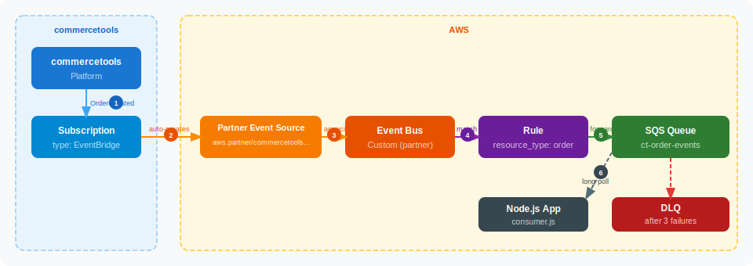

# commercetools → AWS EventBridge Subscription

Terraform configuration that creates a [commercetools Subscription](https://docs.commercetools.com/tutorials/subscriptions-eventbridge) backed by AWS EventBridge, routing order events to an SQS queue consumed by a Node.js application.

## Architecture



### Flow

| Step | What happens |
|---|---|
| **1** | An order event (e.g. `OrderCreated`) is generated inside the **commercetools Platform** |
| **2** | The **commercetools Subscription** (destination: `EventBridge`) captures the event and publishes it to AWS. On first deploy it automatically creates a **Partner Event Source** in your AWS account |
| **3** | Terraform associates the Partner Event Source with a **Custom Event Bus** — this is the named bus that all rules listen on |
| **4** | An **EventBridge Rule** evaluates every inbound event against its pattern (`resource_type_id = "order"`). Only matching events proceed |
| **5** | Matched events are forwarded to the **`ct-order-events` SQS queue**. The queue holds messages until they are consumed or expire |
| **6** | The **Node.js consumer** (`consumer.js`) long-polls the queue, processes each message, then deletes it. If processing fails 3 times the message is moved to the **Dead-Letter Queue (DLQ)** for inspection |

## Prerequisites

- Terraform >= 1.3.0
- AWS credentials configured (`aws configure` or environment variables)
- commercetools API client with the `manage_subscriptions:<project-key>` scope

## Quick Start

```bash
# 1. Copy and fill in credentials
cp terraform.tfvars.example terraform.tfvars

# 2. Initialize providers
terraform init

# 3. Preview changes
terraform plan

# 4. Apply
terraform apply
```

## Variables

| Name | Description | Required | Default |
|---|---|---|---|
| `aws_region` | AWS region for all resources | No | `us-east-2` |
| `aws_account_id` | AWS account ID | Yes | — |
| `environment` | Deployment environment (`dev`, `staging`, `prod`) | No | `dev` |
| `ct_project_key` | commercetools project key | Yes | — |
| `ct_client_id` | commercetools API client ID | Yes | — |
| `ct_client_secret` | commercetools API client secret | Yes | — |
| `ct_scopes` | commercetools API scopes | Yes | — |
| `ct_api_url` | commercetools API URL | Yes | — |
| `ct_auth_url` | commercetools Auth URL | Yes | — |
| `subscription_key` | Unique key for the CT subscription | No | `eventbridge-subscription` |
| `sqs_message_retention_seconds` | DLQ message retention (seconds) | No | `1209600` (14 days) |

## Outputs

| Name | Description |
|---|---|
| `event_bus_name` | Name of the custom EventBridge event bus |
| `event_bus_arn` | ARN of the custom EventBridge event bus |
| `subscription_id` | commercetools subscription ID |
| `partner_event_source_name` | AWS partner event source name |
| `order_events_queue_url` | URL of the `ct-order-events` SQS queue |
| `order_events_queue_arn` | ARN of the `ct-order-events` SQS queue |
| `dlq_url` | Dead-letter queue URL |

## Notes

- **Secrets** — `terraform.tfvars` is git-ignored. Never commit credentials.
- **Two-phase dependency** — commercetools creates the AWS partner event source when the subscription is saved; the event bus association happens in the same `apply` via `depends_on`.
- **SQS encryption** — queues use the AWS-managed SQS KMS key (`alias/aws/sqs`). Replace with a customer-managed key for stricter compliance requirements.
- **DLQ** — messages that fail processing 3 times are moved to the DLQ. Monitor it via CloudWatch or set up an alarm on `ApproximateNumberOfMessagesVisible`.

## References

- [commercetools Subscriptions + EventBridge tutorial](https://docs.commercetools.com/tutorials/subscriptions-eventbridge)
- [commercetools Terraform provider](https://registry.terraform.io/providers/labd/commercetools/latest/docs)
- [AWS EventBridge partner event sources](https://docs.aws.amazon.com/eventbridge/latest/userguide/eb-saas.html)
